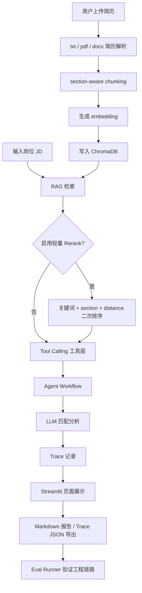

# AI Resume Agent 简历与岗位匹配分析助手

## 项目简介

AI Resume Agent 是一个基于大语言模型、RAG Workflow 和轻量级 Agent Workflow 的简历与岗位匹配分析工具。用户可以上传 txt、pdf 或 docx 简历，输入岗位 JD，并获得岗位要求分析、能力匹配、差距分析和简历优化建议，用于辅助岗位判断与面试准备。

## 项目定位

- AI 应用工程化 Demo。
- RAG Workflow / Agent Workflow MVP。
- 适合学习 AI 应用开发、面试展示和本地流程演示。
- 不是完整的生产级 Agent 平台。

项目重点不是堆叠 Agent 概念，而是展示一条可运行、可解释、可追踪、可基础验证的 AI 应用链路。

## 项目文档

- [最终运行与演示检查清单](FINAL_CHECKLIST.md)
- [实习面试讲解笔记](INTERVIEW_NOTES.md)
- [项目架构说明](docs/architecture.md)
- [FastAPI 接口说明](docs/api.md)
- [Eval Runner 说明](docs/eval.md)

## 核心功能

- txt / pdf / docx 简历文件解析。
- 岗位 JD 输入和普通 LLM 分析。
- RAG 检索增强分析与 ChromaDB 本地向量检索。
- 可选 rule-based lightweight rerank 二次排序。
- section-aware chunking，保留简历模块 metadata。
- 展示 RAG 召回片段、section、chunk_index、distance 和 chunk_length。
- local / local_bge / gemini embedding provider 与 local fallback。
- Tool Calling 工具层：简历解析、RAG 检索、LLM 分析和 Markdown 导出。
- 固定 Agent Workflow 与 Workflow Steps 展示。
- Trace / Observability：运行摘要、工具步骤、耗时、错误和 JSON 导出。
- Eval Runner：使用脱敏样例验证 RAG、Agent Workflow 和 Trace 工程链路。
- FastAPI Backend MVP：通过 HTTP 接口复用 RAG、Agent Workflow 和报告导出。
- Markdown 分析报告导出。

## 技术栈

- Python
- Streamlit
- FastAPI / Uvicorn
- Gemini API（`google-genai` SDK）
- Prompt Engineering
- RAG
- ChromaDB
- sentence-transformers
- pypdf
- python-docx
- python-dotenv

## 项目流程图



## 三种分析模式

### 普通 LLM 分析

将岗位 JD 和简历文本直接放入 Prompt，由 Gemini 生成结构化分析。链路最短，适合快速体验和对比。

### RAG 检索增强分析

先对简历执行 section-aware chunking 和 embedding，再用岗位 JD 从 ChromaDB 召回 top_k 相关片段，最后把召回上下文交给 LLM。页面会展示模型参考的片段及 metadata。

### Agent Workflow 分析

按固定流程调用 `rag_retrieve_tool` 和 `llm_match_analysis_tool`，返回最终分析、Workflow Steps 和 Trace。当前是可讲解的 Tool Calling MVP，不包含动态复杂规划。

## Lightweight Rerank MVP

项目在 ChromaDB 初步召回之后提供可选的 rule-based rerank。开启后，系统会扩大初始候选片段范围，再根据以下可解释信号做二次排序并返回 top_k：

- JD 与 chunk 的关键词重合数量。
- `skills`、`project_experience`、`internship_experience` 等 section bonus。
- 原始 Chroma distance 转换得到的 distance score。

页面会展示 `rerank_score`、`keyword_hits`、`section_bonus` 和原始 `distance`；Agent Trace 和 Eval 也会记录 `used_rerank`、`rerank_method` 和关键词命中摘要。

当前实现不是 cross-encoder reranker，也不是大模型 rerank。它的目标是用低依赖、容易讲解的规则增强召回片段的关键词相关性和 section 覆盖度，同时保留完整的评分解释。

## 快速开始

### 1. 创建虚拟环境

```powershell
cd D:\AIProjects\resume-agent
python -m venv .venv
```

### 2. 安装依赖

```powershell
.\.venv\Scripts\python.exe -m pip install -r requirements.txt
```

### 3. 配置环境变量

复制 `.env.example` 为 `.env`，填写自己的 Gemini API Key：

```env
LLM_PROVIDER=gemini
GEMINI_API_KEY=your_gemini_api_key_here
GEMINI_MODEL=gemini-2.5-flash
OPENAI_COMPATIBLE_API_KEY=your_openai_compatible_api_key_here
OPENAI_COMPATIBLE_BASE_URL=https://api.deepseek.com/v1
OPENAI_COMPATIBLE_MODEL=deepseek-chat
EMBEDDING_PROVIDER=local
LOCAL_EMBEDDING_MODEL=BAAI/bge-small-zh-v1.5
GEMINI_EMBEDDING_MODEL=gemini-embedding-001
```

不要提交 `.env` 或真实 API Key。

Embedding provider：

- `local`：本地 hash embedding，不依赖外部 API，最稳定但语义能力有限。
- `local_bge`：sentence-transformers 本地语义模型，首次使用可能需要下载模型。
- `gemini`：Gemini Embedding，语义能力较好，但依赖网络和 API 配额。

`local_bge` 或 `gemini` 失败时，本次 RAG 会 fallback 到 local embedding。

### 4. 启动 Streamlit

```powershell
.\.venv\Scripts\python.exe -m streamlit run app.py
```

也可以在项目根目录双击 `run_app.bat`。默认访问地址通常是 `http://localhost:8501`。

### 5. 运行基础测试

```powershell
.\.venv\Scripts\python.exe simple_test.py
```

基础测试固定使用 local embedding 和 mock LLM，不要求真实 Gemini 调用。

### 6. 运行 Eval Runner

```powershell
.\.venv\Scripts\python.exe eval_runner.py
```

Eval 结果会写入 `eval_results/eval_result_<timestamp>.json`。

## FastAPI Backend MVP

项目提供最小 FastAPI 后端，通过 HTTP 接口复用现有 `tools.py` 和 `agent_workflow.py`，没有复制核心 RAG 或 Agent 业务逻辑。

支持接口：

- `GET /api/health`：服务健康检查。
- `POST /api/rag/retrieve`：RAG 检索与可选 lightweight rerank。
- `POST /api/agent/workflow`：Agent Workflow、Workflow Steps 和 Trace。
- `POST /api/report/markdown`：生成 Markdown 报告内容。

启动命令：

```powershell
.\.venv\Scripts\python.exe -m uvicorn api_server:app --reload --host 127.0.0.1 --port 8000
```

也可以双击 `run_api.bat`。启动后访问 API 文档：[http://127.0.0.1:8000/docs](http://127.0.0.1:8000/docs)。

服务启动后可运行 smoke test：

```powershell
.\.venv\Scripts\python.exe api_smoke_test.py
```

Smoke test 会为 Agent 请求显式设置 `use_mock_llm=true`，因此不依赖真实 Gemini API。这个后端仍是 MVP，不包含登录、数据库历史记录、权限系统、异步任务队列、Docker 或生产级部署配置。

## Frontend-Backend Decoupling MVP

Streamlit 页面现在支持两种运行后端模式：

- **本地函数模式（默认）**：页面直接调用 Python 业务函数，适合本地快速演示，也保留原有稳定路径。
- **FastAPI 接口模式**：页面通过 `api_client.py` 请求 FastAPI，展示前端展示层与后端接口层的初步解耦。

API mode 中，普通分析和 Agent Workflow 使用 `/api/agent/workflow`；RAG 模式使用 `/api/rag/retrieve` 获取片段。由于当前后端没有单独的“RAG 片段 + LLM 报告”接口，RAG API mode 的 LLM 分析仍在 Streamlit 进程本地执行，页面会明确提示这一边界。

启动后端：

```powershell
.\.venv\Scripts\python.exe -m uvicorn api_server:app --reload --host 127.0.0.1 --port 8000
```

启动 Streamlit：

```powershell
.\.venv\Scripts\python.exe -m streamlit run app.py
```

当前 Streamlit 仍是 Demo UI，不是 React/Vue 等独立前端工程，因此这是前后端分离雏形，而非完整前后端架构。

## Multi-Model Provider MVP

项目使用 `llm_provider.py` 提供统一模型调用入口，支持：

- `gemini`：使用现有 `google-genai` SDK。
- `openai_compatible`：使用 `requests` 调用 Chat Completions 兼容接口，可用于 DeepSeek、Qwen 兼容服务或其他兼容平台。
- `mock`：返回稳定的结构化文本，用于测试、Eval 和无 API Key 的工程链路演示。

普通分析、RAG 分析和 Agent Workflow 不再直接绑定单一模型厂商。Streamlit 侧边栏可选择 provider；API mode 会把 `llm_provider`、`llm_model` 和 `use_mock_llm` 传给后端。未显式传 provider 时，后端读取 `.env` 中的 `LLM_PROVIDER`。

当前实现只是多模型调用 MVP，没有复杂模型路由、成本统计、自动 fallback、熔断、限流或多模型质量评测。显式选择真实 provider 但缺少 Key 时会返回友好错误，不会静默伪装成真实模型结果。

## Trace / Observability

Agent Workflow 每次运行都会生成 `run_id`，记录输入长度、top_k、embedding provider、是否 fallback、总耗时、最终状态以及每个工具步骤的输入输出摘要、耗时和错误。

页面支持 Trace 摘要、Trace Steps、`st.json` 查看和 JSON 下载。本地 Trace 默认保存到 `outputs/traces/`，保存失败不会中断分析。仓库中的 [Trace 说明](examples/example_trace_readme.md) 解释了运行产物策略。

这是教学和面试展示级的轻量观测实现，不等同于 LangSmith 或 OpenTelemetry。

## RAG Evaluation System MVP

`eval_cases/` 保存可提交的脱敏简历、岗位 JD 和 `expected.json`。每个 case 使用 expected sections、expected keywords，以及由 section + keywords 组成的简化 gold evidence。

`eval_runner.py` 计算并对比普通 RAG 与 RAG + Rerank：

- Recall@1 / Recall@3 / Recall@5。
- MRR（第一个相关片段排名的倒数）。
- section hit rate、keyword hit rate 和 gold recall。
- Rerank 的 improved / same / worse 对比。
- 原有 Agent Workflow、Trace 和输出结构检查。

运行 `.\.venv\Scripts\python.exe eval_runner.py` 后，JSON 与 Markdown summary 会保存到 `eval_results/`。默认只评测 local embedding，后续可以扩展 provider 对比。

为了可复现并避免依赖 API 配额，Eval Runner 使用确定性 mock LLM。当前 gold evidence 不是人工逐 chunk 严格标注，样例数量也较少，因此这是教学和面试展示级 RAG 评测 MVP，主要验证检索与工程链路，不代表真实模型最终答案质量。详细说明见 [Eval 文档](docs/eval.md)。

## 示例产物

- [示例分析报告](examples/example_report.md)
- [Trace JSON 说明](examples/example_trace_readme.md)
- `eval_cases/`：脱敏评测输入。
- `eval_results/`：本地生成的评测结果，不提交 Git。
- `outputs/traces/`：本地生成的 Trace JSON，不提交 Git。

## 项目结构

```text
resume-agent/
├─ app.py                  # Streamlit 页面、三种模式、结果与 Trace 展示
├─ agent.py                # Prompt、普通 LLM 与 RAG 分析逻辑
├─ llm_provider.py         # Gemini / OpenAI-compatible / Mock 统一调用层
├─ rag.py                  # section-aware chunking、embedding、ChromaDB 检索
├─ rerank_utils.py         # 关键词、section、distance 规则二次排序
├─ prompts.py              # 系统 Prompt、普通分析 Prompt、RAG Prompt
├─ tools.py                # ToolResult 和四个 Agent 工具
├─ agent_workflow.py       # 固定 Tool Calling Workflow 与 Trace 接入
├─ trace_utils.py          # Trace dataclass、摘要、序列化与 JSON 保存
├─ eval_runner.py          # 工程型基础评测入口
├─ rag_eval_utils.py       # Recall@K、MRR 和 gold evidence 评测工具
├─ api_server.py           # FastAPI health、RAG、Agent、Markdown 接口
├─ api_client.py           # Streamlit 调用 FastAPI 的统一 HTTP Client
├─ api_smoke_test.py       # 已启动 API 的四接口 smoke test
├─ simple_test.py          # 快速、无真实 LLM 依赖的基础测试
├─ eval_cases/             # 可提交的脱敏 Eval 样例
├─ examples/               # 示例报告和 Trace 说明
├─ docs/                   # 架构、API 和 Eval 专题文档
├─ samples/                # 页面演示用简历和岗位 JD
├─ outputs/traces/         # 运行生成的 Trace，Git 忽略
├─ eval_results/           # 运行生成的 Eval 结果，Git 忽略
├─ requirements.txt        # Python 依赖
├─ .env.example            # 安全的环境变量模板
├─ run_app.bat             # Windows 一键启动脚本
├─ run_api.bat             # Windows 一键启动 FastAPI
├─ FINAL_CHECKLIST.md       # 运行、演示、安全和面试检查清单
├─ INTERVIEW_NOTES.md       # 面试讲解参考
└─ README.md
```

## 面试讲解路径

1. 先介绍项目解决的简历优化、岗位匹配和面试准备问题。
2. 对比普通 LLM 分析与 RAG 分析的输入链路和可解释性。
3. 说明 section-aware chunking 如何减少跨简历模块切分。
4. 说明 ChromaDB 如何保存 chunk、section、位置和来源 metadata。
5. 说明 Tool Calling 如何封装 RAG 检索、LLM 分析和报告导出。
6. 说明 Agent Workflow 如何按固定流程调用工具，而非夸大为复杂自主 Agent。
7. 展示 Trace 如何定位召回为空、工具失败、耗时或 embedding fallback。
8. 展示 Eval Runner 如何用固定样例验证工程链路稳定性。
9. 最后说明当前边界和可以继续投入的优化方向。

## 项目边界

- 当前不是生产级系统或完整 Agent 平台。
- 没有复杂 planning 和动态工具选择。
- 没有多 Agent 协作。
- 没有长期记忆。
- FastAPI 仅为接口 MVP，没有鉴权、历史数据库、任务队列和生产部署方案。
- Trace 不是生产级分布式观测系统。
- 没有严格的模型质量评测、人工标注集或统计显著性分析。
- Eval Runner 主要验证工程链路稳定性，不代表 Gemini 或其他真实模型的输出质量。
- local hash embedding 更适合稳定演示，不代表高质量语义检索效果。

## 后续优化方向

- 在数据规模和质量要求提升后评估 cross-encoder reranker。
- 将 FastAPI MVP 升级为带统一错误码、超时和配置管理的服务层。
- 支持更多 LLM 和 embedding provider。
- 扩充人工相关性标注、nDCG 和真实模型答案质量评测。
- 在需求复杂度确实提升后评估 LangChain / LangGraph。
- 增加更完整的 Agent 规划、工具选择和状态管理能力。

## 常见问题

### Gemini 429 / RESOURCE_EXHAUSTED

通常表示 API 配额不足或请求过多。可以稍后重试、降低调用频率或检查计费和 Key 配置。即使 embedding 使用 local，页面中的最终 LLM 分析仍需要 Gemini API。

### PDF 没有解析出文本

当前使用 pypdf 提取可复制文本，不包含 OCR。扫描版或图片型 PDF 需要后续接入 OCR。

### local_bge 首次运行较慢

sentence-transformers 可能需要首次下载模型。需要完全离线、稳定的演示时可设置 `EMBEDDING_PROVIDER=local`。
