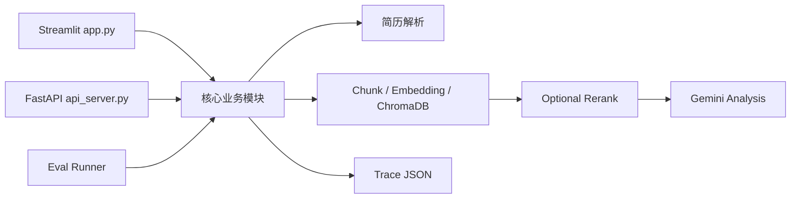

# 项目架构

## 项目整体架构

AI Resume Agent 采用同一套 Python 业务模块支撑两个入口：Streamlit 页面用于本地交互演示，FastAPI 用于提供 HTTP 接口雏形。核心检索、工具和 Workflow 不在两个入口中重复实现。



## 核心模块职责

### `app.py`

Streamlit 展示层，负责简历上传、JD 输入、三种模式选择、RAG 片段、Workflow Steps、Trace 和导出按钮。

### `agent.py`

负责 Gemini 客户端、Prompt 调用、错误提示，以及普通 LLM / RAG 报告的生成和拆分。

### `tools.py`

轻量工具层。统一使用 `ToolResult` 封装简历解析、RAG 检索、LLM 分析和 Markdown 导出结果。

### `agent_workflow.py`

固定 Agent Workflow 编排。按配置执行 RAG、可选 Rerank 和 LLM 分析，并生成 Workflow Steps 与 Trace。

### `trace_utils.py`

定义 `TraceStep`、`WorkflowTrace`，提供时间、摘要、字典序列化和 JSON 保存能力。

### `rerank_utils.py`

提供 JD 关键词提取，以及基于关键词重合、section bonus 和 distance 的规则二次排序。

### `eval_runner.py`

加载 `eval_cases/`，使用 local embedding 和 mock LLM 验证 RAG、Rerank、Workflow、Trace 与输出结构。

### `api_server.py`

FastAPI 接口层。负责 Pydantic 校验和 HTTP 响应映射，复用 `tools.py` 与 `agent_workflow.py`。

## 数据流

```text
用户上传简历
-> 文本解析
-> section-aware chunking
-> embedding
-> ChromaDB
-> RAG retrieve
-> optional rerank
-> LLM analysis
-> trace
-> 页面或 API 结果
-> Markdown / JSON 导出
```

## 为什么先用 Streamlit

Streamlit 适合快速验证 AI 应用交互：上传文件、调整 top_k、查看召回片段和下载结果都可以用较少页面代码完成。对于学习和面试 Demo，它能把精力集中在 RAG 与 Workflow 本身。

## 为什么补 FastAPI

FastAPI 将核心能力暴露为稳定的 JSON 接口，展示请求模型、参数校验和接口文档能力，也为后续把 Streamlit 或其他前端改为 HTTP 调用提供基础。当前 Streamlit 仍直接调用模块，因此只是前后端分离雏形。

## 当前架构边界

- 单机、本地优先的 MVP。
- ChromaDB collection 会围绕当前简历重建，不适合多用户并发历史管理。
- 同步 LLM 调用，没有任务队列。
- 没有登录、权限、历史数据库和生产部署配置。
- Agent Workflow 是固定流程，没有复杂 planning。
- Trace 与 Eval 都是轻量工程实现。

## 后续可升级方向

- 让 Streamlit 通过 FastAPI 调用核心能力。
- 增加统一响应模型、错误码、超时和限流。
- 增加持久化任务与多用户数据隔离。
- 增加严格检索指标和真实模型评测。
- 根据数据规模评估 cross-encoder reranker。
- 在需求明确后引入更复杂的 Agent 状态图。
