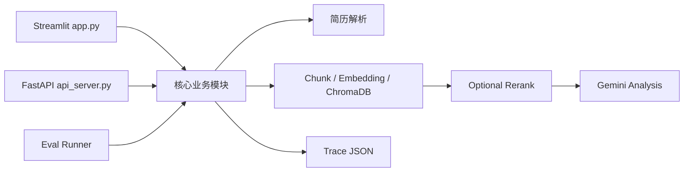

# 项目架构

## 项目整体架构

AI Resume Agent 采用同一套 Python 业务模块支撑两个入口：Streamlit 页面用于本地交互演示，FastAPI 用于提供 HTTP 接口雏形。核心检索、工具和 Workflow 不在两个入口中重复实现。



## 核心模块职责

### `app.py`

Streamlit 展示层，负责简历上传、JD 输入、三种模式选择、RAG 片段、Workflow Steps、Trace 和导出按钮。

### `agent.py`

负责 Prompt 构造、普通 LLM / RAG 报告生成与拆分，通过 `llm_provider.py` 调用模型。

### `llm_provider.py`

统一 LLM Provider 层，封装 Gemini、OpenAI-compatible Chat Completions 和 deterministic mock。业务 Workflow 只传 provider/model，不直接处理不同厂商协议。

### `tools.py`

轻量工具层。统一使用 `ToolResult` 封装简历解析、RAG 检索、LLM 分析和 Markdown 导出结果。

### `agent_workflow.py`

固定 Agent Workflow 编排。按配置执行 RAG、可选 Rerank 和 LLM 分析，并生成 Workflow Steps 与 Trace。

### `trace_utils.py`

定义 `TraceStep`、`WorkflowTrace`，提供时间、摘要、字典序列化和 JSON 保存能力。

### `rerank_utils.py`

提供 JD 关键词提取，以及基于关键词重合、section bonus 和 distance 的规则二次排序。

### `eval_runner.py`

加载 `eval_cases/`，使用 local embedding 和 mock LLM 验证 RAG、Rerank、Workflow、Trace 与输出结构。

### `api_server.py`

FastAPI 接口层。负责 Pydantic 校验和 HTTP 响应映射，复用 `tools.py` 与 `agent_workflow.py`。

## 数据流

```text
用户上传简历
-> 文本解析
-> section-aware chunking
-> embedding
-> ChromaDB
-> RAG retrieve
-> optional rerank
-> LLM analysis
-> trace
-> 页面或 API 结果
-> Markdown / JSON 导出
```

## 为什么先用 Streamlit

Streamlit 适合快速验证 AI 应用交互：上传文件、调整 top_k、查看召回片段和下载结果都可以用较少页面代码完成。对于学习和面试 Demo，它能把精力集中在 RAG 与 Workflow 本身。

## 为什么补 FastAPI

FastAPI 将核心能力暴露为稳定的 JSON 接口，展示请求模型、参数校验和接口文档能力，也为后续替换其他前端提供基础。Streamlit 现在可以选择直接调用模块或通过 HTTP 调用 FastAPI。

## 为什么抽象 LLM Provider

- 避免 Prompt、RAG 和 Agent Workflow 与单一模型 SDK 耦合。
- 让本地页面和 FastAPI 使用相同 provider 参数。
- 使用 mock 保证测试和 Eval 不依赖外部网络与额度。
- 为 OpenAI-compatible 服务提供最小接入点，而不引入额外 SDK。

当前 provider 层不负责自动选模、价格比较、熔断、限流或质量路由；真实模型的 Key、URL 和模型名仍由环境变量管理。

## Provider Health Check 与 Fallback

健康检查位于 `llm_provider.py`：先检查 Key、Base URL 和 provider 名称，配置完整时才使用短 Prompt 发起轻量请求。Mock Provider 不访问网络。

`generate_with_llm` 的调用流程：

```text
选择 provider
-> 执行真实模型或 Mock
-> 成功：返回 LLMResult
-> 失败且 fallback_to_mock=True：返回 Mock 文本并保留原错误
-> 失败且 fallback_to_mock=False：返回 success=False
```

需要区分三个概念：Mock 是显式测试 provider；真实 provider 表示实际外部模型；fallback 是真实 provider 失败后的降级结果。Fallback Trace 会保留 original provider 和 provider error，不能当成真实模型成功。

当前实现是单次调用级 fallback，不包含熔断状态机、流量切换、重试队列、成本策略和集中监控。

**重要区分**：Mock Provider 用于本地测试和 Eval，不依赖外部服务；`fallback_to_mock` 是真实 Provider（Gemini / OpenAI-compatible）调用失败后的工程降级。Trace 中 `fallback_used=true` 表示真实 Provider 失败后降级到 Mock，不代表真实模型调用成功。判断真实模型是否成功应同时检查 `fallback_used=false` 且 `provider_error` 为空。

## Local Mode 数据流

```text
Streamlit UI
-> 本地 Python 函数
-> RAG / Agent Workflow / Trace
-> Streamlit 展示与导出
```

Local mode 是默认模式，避免 API 服务未启动时影响 Demo，也便于单机调试和快速面试展示。

## API Mode 数据流

```text
Streamlit UI
-> api_client.py
-> HTTP / JSON
-> FastAPI api_server.py
-> tools.py / agent_workflow.py
-> HTTP response
-> Streamlit 展示
```

普通分析与 Agent Workflow 通过 `/api/agent/workflow`。RAG 模式通过 `/api/rag/retrieve` 获取片段；当前其后续 LLM 报告仍在 Streamlit 进程本地生成，因为后端尚未提供独立 RAG 分析接口。

## 为什么保留 Local Mode

- 保留已有稳定功能与最低演示依赖。
- API 服务不可用时仍可运行项目。
- 方便定位问题属于 UI、HTTP 还是核心业务模块。
- 避免为了展示解耦而提前引入复杂部署结构。

## FastAPI Mode 的价值

API mode 验证了展示层可以依赖 JSON 接口，为后续替换成 React/Vue、小程序或其他客户端提供基础，也可以独立做接口测试、鉴权和服务部署。

## 当前解耦边界

- Streamlit 不是独立前端工程，仍与业务代码处于同一仓库和 Python 环境。
- RAG API mode 的 LLM 分析暂时仍走本地函数。
- 文件上传尚未通过 multipart API，页面先解析为文本后再请求后端。
- 没有统一用户身份、历史数据库、任务队列和生产网关。
- API 与 local mode 复用同一个本地 ChromaDB 设计，不适合多用户并发。

## 当前架构边界

- 单机、本地优先的 MVP。
- ChromaDB collection 会围绕当前简历重建，不适合多用户并发历史管理。
- 同步 LLM 调用，没有任务队列。
- 没有登录、权限、历史数据库和生产部署配置。
- Agent Workflow 是固定流程，没有复杂 planning。
- Trace 与 Eval 都是轻量工程实现。

## 后续可升级方向

- 让 API mode 覆盖文件上传和完整 RAG 报告生成。
- 增加统一响应模型、错误码、超时和限流。
- 增加持久化任务与多用户数据隔离。
- 增加严格检索指标和真实模型评测。
- 根据数据规模评估 cross-encoder reranker。
- 在需求明确后引入更复杂的 Agent 状态图。
